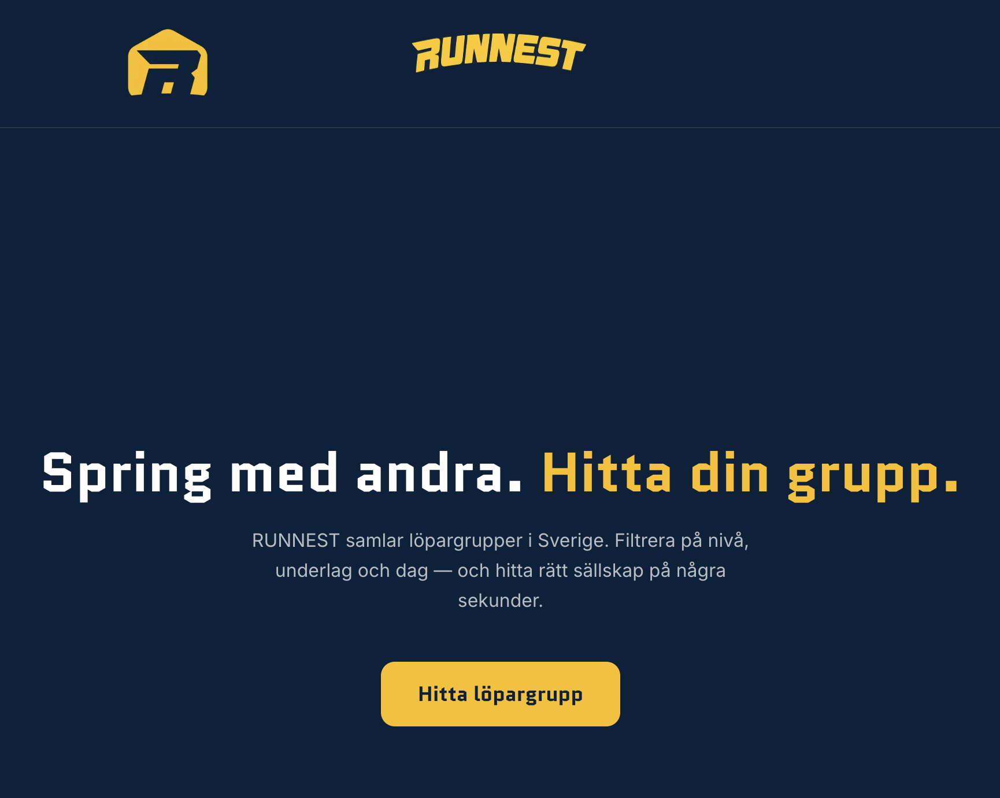
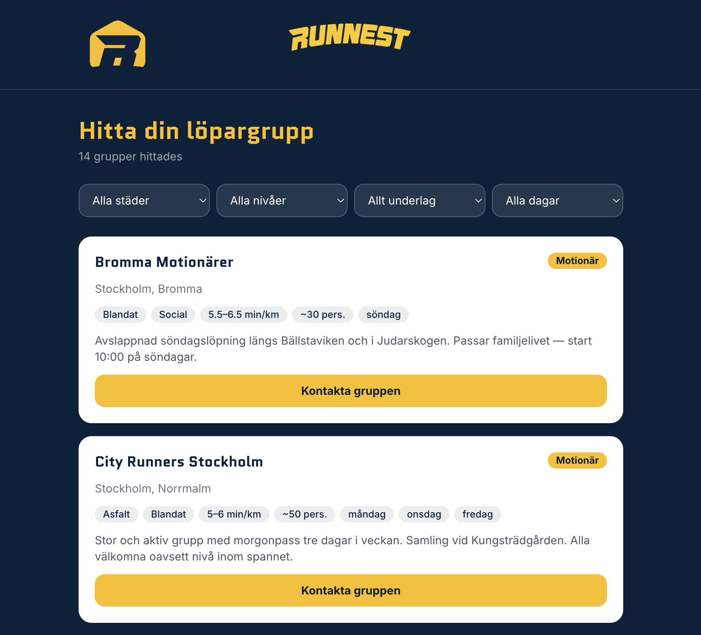

# RUNNEST

**Svenska:** RUNNEST hjälper amatörlöpare att hitta löpargrupper i sin stad — och hjälper grupper att göra sig hittbara. Filtrera på nivå, underlag och dag och hitta rätt sällskap på några sekunder.

**English:** RUNNEST helps recreational runners find running groups in their city — and helps groups get discovered. Filter by level, surface and day to find the right crew in seconds.

---





---

## Stack

- [Next.js](https://nextjs.org) (App Router) + TypeScript
- [Tailwind CSS](https://tailwindcss.com) v4
- [Supabase](https://supabase.com) (Postgres)
- PWA (manifest + service worker)
- Hosted on [Vercel](https://vercel.com)

## Kom igång / Getting started

```bash
# Installera beroenden / Install dependencies
npm install

# Kopiera miljövariabler / Copy environment variables
cp .env.local.example .env.local
# Fyll i NEXT_PUBLIC_SUPABASE_URL och NEXT_PUBLIC_SUPABASE_ANON_KEY

# Starta dev-server / Start dev server
npm run dev
```

Öppna [http://localhost:3000](http://localhost:3000).

## Databas / Database

Kör SQL-filerna i Supabase SQL Editor:

1. `supabase/migrations/0001_create_groups.sql` — skapar tabellen
2. `supabase/seeds/groups.sql` — lägger in testgrupper i Stockholm
